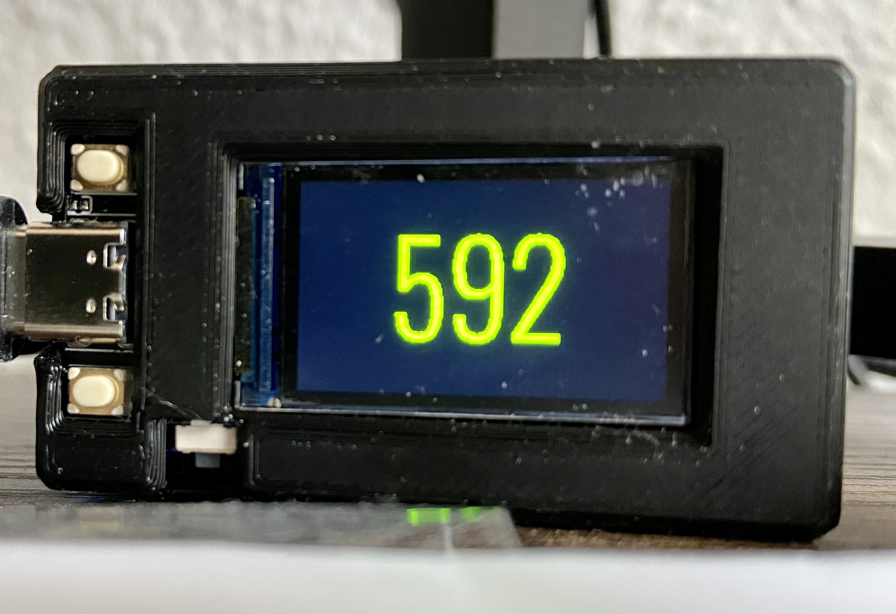
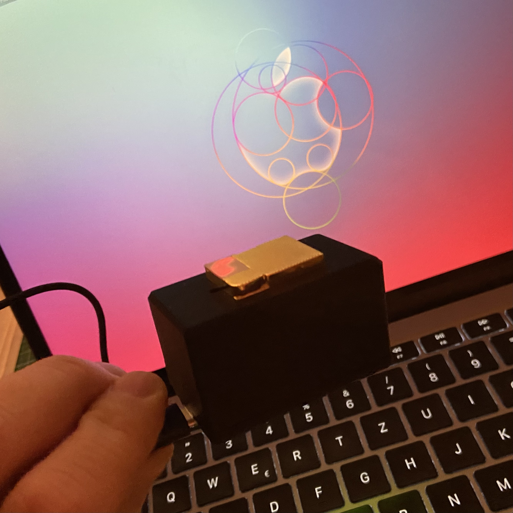

Implementierung eines co2 Sensors, basierend auf einem ESP32 und einem MH-Z19, inkl. lokale Anzeige des aktuellen Wertes auf einem Display.

## Bilder

## Genutzte Hardware:
- ICQUANZX T-Display ESP32 WiFi und Bluetooth Modul Entwicklungsboard für Arduino 1.14 Zoll LCD ([https://www.amazon.de/gp/product/B07VNG9D52/ref=ppx_yo_dt_b_asin_title_o01_s00?ie=UTF8&psc=1]())
- MH-Z19C ([https://www.amazon.de/gp/product/B096XXPHHY/ref=ppx_yo_dt_b_asin_title_o05_s00?ie=UTF8&psc=1]())
- TTGO Gehäuse Front ([https://www.thingiverse.com/thing:3777859]())
- TTGO Gehäuse Basis ([https://www.thingiverse.com/thing:4108699]())

## Info
Die Implementierung habe ich in esphome vorgenommen, das passende .yaml File ist im Repository abgelegt. Ich habe mich bei jemanden bedient, finde leider aber den Link in sein Repo nicht mehr. Die Implementierung ist als WIP zu sehen.

## Besonderheiten
* Anzeige co2 Wert in ppm
* Farbe in Abhängigkeit vom Wert

### Bei USB Port links gilt
* obere Taste kurz drücken: Display an/aus
* obere Taste lange drücken: derzeit keine Funktion
* untere Taste kurz drücken: Wechsel in den Infoscreen und zurück
* untere Taste lange drücken: Kalibrierung mh-z19 Sensor (zuvor mind. 20 Minuten 400ppm bereitstellen, z.B. nach am offenen Fenster)
